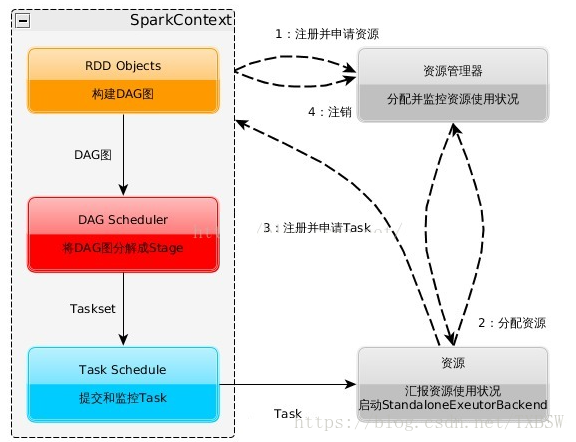
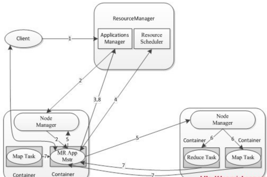

## Spark面试题（一）  

### 1、spark的有几种部署模式，每种模式特点？（☆☆☆☆☆）  
1）本地模式  
&emsp; Spark不一定非要跑在hadoop集群，可以在本地，起多个线程的方式来指定。将Spark应用以多线程的方式直接运行在本地，一般都是为了方便调试，本地模式分三类  
&emsp; local：只启动一个executor  
&emsp; local[k]:启动k个executor  
&emsp; local[*]：启动跟cpu数目相同的 executor  
2）standalone模式  
&emsp; 分布式部署集群，自带完整的服务，资源管理和任务监控是Spark自己监控，这个模式也是其他模式的基础。  
3）Spark on yarn模式  
&emsp; 分布式部署集群，资源和任务监控交给yarn管理，但是目前仅支持粗粒度资源分配方式，包含cluster和client运行模式，cluster适合生产，driver运行在集群子节点，具有容错功能，client适合调试，dirver运行在客户端。  
4）Spark On Mesos模式。  
&emsp; 官方推荐这种模式（当然，原因之一是血缘关系）。正是由于Spark开发之初就考虑到支持Mesos，因此，目前而言，Spark运行在Mesos上会比运行在YARN上更加灵活，更加自然。用户可选择两种调度模式之一运行自己的应用程序：  
&emsp; （1）粗粒度模式（Coarse-grained Mode）：每个应用程序的运行环境由一个Dirver和若干个Executor组成，其中，每个Executor占用若干资源，内部可运行多个Task（对应多少个“slot”）。应用程序的各个任务正式运行之前，需要将运行环境中的资源全部申请好，且运行过程中要一直占用这些资源，即使不用，最后程序运行结束后，回收这些资源。  
&emsp; （2）细粒度模式（Fine-grained Mode）：鉴于粗粒度模式会造成大量资源浪费，Spark On Mesos还提供了另外一种调度模式：细粒度模式，这种模式类似于现在的云计算，思想是按需分配。  

### 2、Spark为什么比mapreduce快？（☆☆☆☆☆）  
&emsp; 1）基于内存计算，减少低效的磁盘交互；  
&emsp; 2）高效的调度算法，基于DAG；  
&emsp; 3）容错机制Linage，精华部分就是DAG和Lingae  

```
 DAG，有向无环图，Directed Acyclic Graph的缩写，常用于建模。Spark中使用DAG对RDD的关系进行建模，描述了RDD的依赖关系，这种关系也被称之为lineage，RDD的依赖关系使用Dependency维护，参考Spark RDD之Dependency，DAG在Spark中的对应的实现为DAGScheduler。
————————————————
版权声明：本文为CSDN博主「zhangvalue」的原创文章，遵循CC 4.0 BY-SA版权协议，转载请附上原文出处链接及本声明。
原文链接：https://blog.csdn.net/zhangvalue/article/details/84780428

https://zhuanlan.zhihu.com/p/470482936
Spark的任务调度从 DAG 划分开始，由 DAGScheduler 完成
DAGScheduler 根据 RDD 的血缘关系构成的 DAG 进行切分，将一个Job划分为若干Stages
具体划分策略是：
从最后一个RDD开始，通过回溯依赖判断父依赖是否是宽依赖（即以Shuffle为界），划分Stage；


```


### 3、简单说一下hadoop和spark的shuffle相同和差异？（☆☆☆☆☆）  
&emsp; 1）从 high-level 的角度来看，两者并没有大的差别。 都是将 mapper（Spark 里是 ShuffleMapTask）的输出进行 partition，不同的 partition 送到不同的 reducer（Spark 里 reducer 可能是下一个 stage 里的 ShuffleMapTask，也可能是 ResultTask）。Reducer 以内存作缓冲区，边 shuffle 边 aggregate 数据，等到数据 aggregate 好以后进行 reduce() （Spark 里可能是后续的一系列操作）。  
&emsp; 2）从 low-level 的角度来看，两者差别不小。 Hadoop MapReduce 是 sort-based，进入 combine() 和 reduce() 的 records 必须先 sort。这样的好处在于 combine/reduce() 可以处理大规模的数据，因为其输入数据可以通过外排得到（mapper 对每段数据先做排序，reducer 的 shuffle 对排好序的每段数据做归并）。目前的 Spark 默认选择的是 hash-based，通常使用 HashMap 来对 shuffle 来的数据进行 aggregate，不会对数据进行提前排序。如果用户需要经过排序的数据，那么需要自己调用类似 sortByKey() 的操作；如果你是Spark 1.1的用户，可以将spark.shuffle.manager设置为sort，则会对数据进行排序。在Spark 1.2中，sort将作为默认的Shuffle实现。  
&emsp; 3）从实现角度来看，两者也有不少差别。 Hadoop MapReduce 将处理流程划分出明显的几个阶段：map(), spill, merge, shuffle, sort, reduce() 等。每个阶段各司其职，可以按照过程式的编程思想来逐一实现每个阶段的功能。在 Spark 中，没有这样功能明确的阶段，只有不同的 stage 和一系列的 transformation()，所以 spill, merge, aggregate 等操作需要蕴含在 transformation() 中。  
&emsp; 如果我们将 map 端划分数据、持久化数据的过程称为 shuffle write，而将 reducer 读入数据、aggregate 数据的过程称为 shuffle read。那么在 Spark 中，问题就变为怎么在 job 的逻辑或者物理执行图中加入 shuffle write 和 shuffle read的处理逻辑？以及两个处理逻辑应该怎么高效实现？  
&emsp; Shuffle write由于不要求数据有序，shuffle write 的任务很简单：将数据 partition 好，并持久化。之所以要持久化，一方面是要减少内存存储空间压力，另一方面也是为了 fault-tolerance。  

### 4、spark工作机制？（☆☆☆☆☆）  
<p align="center">
  
<p align="center">
</p>
</p>  


① 构建Application的运行环境，Driver创建一个SparkContext
<p align="center">
  
<p align="center">
</p>
</p>  

② SparkContext向资源管理器（Standalone、Mesos、Yarn）申请Executor资源，资源管理器启动StandaloneExecutorbackend（Executor）
③ Executor向SparkContext申请Task
④ SparkContext将应用程序分发给Executor
⑤ SparkContext就建成DAG图，DAGScheduler将DAG图解析成Stage，每个Stage有多个task，形成taskset发送给task Scheduler，由task Scheduler将Task发送给Executor运行
⑥ Task在Executor上运行，运行完释放所有资源

### 4.1 运行架构

Spark 框架的核心是一个计算引擎，整体来说，它采用了标准 master-slave 的结构。如下图所示，它展示了一个 Spark 执行时的基本结构。图形中的Driver 表示 master，

负责管理整个集群中的作业任务调度。图形中的Executor 则是 slave，负责实际执行任务。


### 5、spark的优化怎么做？ （☆☆☆☆☆）  

&emsp; spark调优比较复杂，但是大体可以分为三个方面来进行  
&emsp; 1）平台层面的调优：防止不必要的jar包分发，提高数据的本地性，选择高效的存储格式如parquet  
&emsp; 2）应用程序层面的调优：过滤操作符的优化降低过多小任务，降低单条记录的资源开销，处理数据倾斜，复用RDD进行缓存，作业并行化执行等等  
&emsp; 3）JVM层面的调优：设置合适的资源量，设置合理的JVM，启用高效的序列化方法如kyro，增大off head内存等等  

### 6、数据本地性是在哪个环节确定的？（☆☆☆☆☆）  
&emsp; 具体的task运行在那他机器上，dag划分stage的时候确定的  

### 7、RDD的弹性表现在哪几点？（☆☆☆☆☆）  
 	存储的弹性：内存与磁盘的自动切换；
	 容错的弹性：数据丢失可以自动恢复；【上图比如第二个分区(3,4)数据丢失，不用担心，因为知道来自第二个分区可以重新来读取】
	 计算的弹性：计算出错重试机制；【计算出现错误可以重头开始计算，没必要因为一个executor出现错误而导致整个job失败】
	 分片的弹性：可根据需要重新分片。【这里的分片就是分区，类似kafka的分区】  

### 8、RDD有哪些缺陷？（☆☆☆☆☆）  
&emsp; 1）不支持细粒度的写和更新操作（如网络爬虫），spark写数据是粗粒度的。所谓粗粒度，就是批量写入数据，为了提高效率。但是读数据是细粒度的也就是说可以一条条的读。  
&emsp; 2）不支持增量迭代计算，Flink支持  

### 9、Spark的shuffle过程？（☆☆☆☆☆）
&emsp; 从下面三点去展开  
&emsp; 1）shuffle过程的划分  
&emsp; 2）shuffle的中间结果如何存储  
&emsp; 3）shuffle的数据如何拉取过来  
&emsp; 可以参考这篇博文：http://www.cnblogs.com/jxhd1/p/6528540.html  

### 10、 Spark的数据本地性有哪几种？（☆☆☆☆☆）  
&emsp; Spark中的数据本地性有三种：  
&emsp; 1）PROCESS_LOCAL是指读取缓存在本地节点的数据  
&emsp; 2）NODE_LOCAL是指读取本地节点硬盘数据  
&emsp; 3）ANY是指读取非本地节点数据  
&emsp; 通常读取数据PROCESS_LOCAL>NODE_LOCAL>ANY，尽量使数据以PROCESS_LOCAL或NODE_LOCAL方式读取。其中PROCESS_LOCAL还和cache有关，如果RDD经常用的话将该RDD cache到内存中，注意，由于cache是lazy的，所以必须通过一个action的触发，才能真正的将该RDD cache到内存中。  

### 11、Spark为什么要持久化，一般什么场景下要进行persist操作？（☆☆☆）  
&emsp; 为什么要进行持久化？  
&emsp; spark所有复杂一点的算法都会有persist身影，spark默认数据放在内存，spark很多内容都是放在内存的，非常适合高速迭代，1000个步骤只有第一个输入数据，中间不产生临时数据，但分布式系统风险很高，所以容易出错，就要容错，rdd出错或者分片可以根据血统算出来，如果没有对父rdd进行persist 或者cache的化，就需要重头做。 
&emsp; 以下场景会使用persist  
&emsp; 1）某个步骤计算非常耗时，需要进行persist持久化  
&emsp; 2）计算链条非常长，重新恢复要算很多步骤，很好使，persist  
&emsp; 3）checkpoint所在的rdd要持久化persist。checkpoint前，要持久化，写个rdd.cache或者rdd.persist，将结果保存起来，再写checkpoint操作，这样执行起来会非常快，不需要重新计算rdd链条了。checkpoint之前一定会进行persist。   
&emsp; 4）shuffle之后要persist，shuffle要进性网络传输，风险很大，数据丢失重来，恢复代价很大  
&emsp; 5）shuffle之前进行persist，框架默认将数据持久化到磁盘，这个是框架自动做的。  

### 12、介绍一下join操作优化经验？（☆☆☆☆☆）  
&emsp; join其实常见的就分为两类： map-side join 和  reduce-side join。当大表和小表join时，用map-side join能显著提高效率。将多份数据进行关联是数据处理过程中非常普遍的用法，不过在分布式计算系统中，这个问题往往会变的非常麻烦，因为框架提供的 join 操作一般会将所有数据根据 key 发送到所有的 reduce 分区中去，也就是 shuffle 的过程。造成大量的网络以及磁盘IO消耗，运行效率极其低下，这个过程一般被称为 reduce-side-join。如果其中有张表较小的话，我们则可以自己实现在 map 端实现数据关联，跳过大量数据进行 shuffle 的过程，运行时间得到大量缩短，根据不同数据可能会有几倍到数十倍的性能提升。   
&emsp; 备注：这个题目面试中非常非常大概率见到，务必搜索相关资料掌握，这里抛砖引玉。  

### 13、描述Yarn执行一个任务的过程？（☆☆☆☆☆）  
<p align="center">
  
<p align="center">
</p>
</p>  
&emsp; 1）客户端client向ResouceManager提交Application，ResouceManager接受Application并根据集群资源状况选取一个node来启动Application的任务调度器driver（ApplicationMaster）。  
&emsp; 2）ResouceManager找到那个node，命令其该node上的nodeManager来启动一个新的 JVM进程运行程序的driver（ApplicationMaster）部分，driver（ApplicationMaster）启动时会首先向ResourceManager注册，说明由自己来负责当前程序的运行。  
&emsp; 3）driver（ApplicationMaster）开始下载相关jar包等各种资源，基于下载的jar等信息决定向ResourceManager申请具体的资源内容。  
&emsp; 4）ResouceManager接受到driver（ApplicationMaster）提出的申请后，会最大化的满足 资源分配请求，并发送资源的元数据信息给driver（ApplicationMaster）。  
&emsp; 5）driver（ApplicationMaster）收到发过来的资源元数据信息后会根据元数据信息发指令给具体机器上的NodeManager，让其启动具体的container。  
&emsp; 6）NodeManager收到driver发来的指令，启动container，container启动后必须向driver（ApplicationMaster）注册。  
&emsp; 7）driver（ApplicationMaster）收到container的注册，开始进行任务的调度和计算，直到 任务完成。  
&emsp; 注意：如果ResourceManager第一次没有能够满足driver（ApplicationMaster）的资源请求 ，后续发现有空闲的资源，会主动向driver（ApplicationMaster）发送可用资源的元数据信息以提供更多的资源用于当前程序的运行。  

### 14、Spark on Yarn 模式有哪些优点？（☆☆☆☆☆）  
&emsp; 1）与其他计算框架共享集群资源（Spark框架与MapReduce框架同时运行，如果不用Yarn进行资源分配，MapReduce分到的内存资源会很少，效率低下）；资源按需分配，进而提高集群资源利用等。  
&emsp; 2）相较于Spark自带的Standalone模式，Yarn的资源分配更加细致。   
&emsp; 3）Application部署简化，例如Spark，Storm等多种框架的应用由客户端提交后，由Yarn负责资源的管理和调度，利用Container作为资源隔离的单位，以它为单位去使用内存,cpu等。   
&emsp; 4）Yarn通过队列的方式，管理同时运行在Yarn集群中的多个服务，可根据不同类型的应用程序负载情况，调整对应的资源使用量，实现资源弹性管理。  

### 15、谈谈你对container的理解？（☆☆☆☆☆）  
&emsp; 1）Container作为资源分配和调度的基本单位，其中封装了的资源如内存，CPU，磁盘，网络带宽等。 目前yarn仅仅封装内存和CPU   
&emsp; 2）Container由ApplicationMaster向ResourceManager申请的，由ResouceManager中的资源调度器异步分配给ApplicationMaster  
&emsp; 3）Container的运行是由ApplicationMaster向资源所在的NodeManager发起的，Container运行时需提供内部执行的任务命令  

```
总结：yarn的container和spark的executor基本上是等价的，一个container对应一个JVM进程（也就是一个executor） lh
```

### 16、Spark使用parquet文件存储格式能带来哪些好处？（☆☆☆☆☆）  

&emsp; 1）如果说HDFS是大数据时代分布式文件系统首选标准，那么parquet则是整个大数据时代文件存储格式实时首选标准。  
&emsp; 2）速度更快：从使用spark sql操作普通文件CSV和parquet文件速度对比上看，绝大多数情况会比使用csv等普通文件速度提升10倍左右，在一些普通文件系统无法在spark上成功运行的情况下，使用parquet很多时候可以成功运行。  
&emsp; 3）parquet的压缩技术非常稳定出色，在spark sql中对压缩技术的处理可能无法正常的完成工作（例如会导致lost task，lost executor）但是此时如果使用parquet就可以正常的完成。  
&emsp; 4）极大的减少磁盘I/o,通常情况下能够减少75%的存储空间，由此可以极大的减少spark sql处理数据的时候的数据输入内容，尤其是在spark1.6x中有个下推过滤器在一些情况下可以极大的减少磁盘的IO和内存的占用，（下推过滤器）。  
&emsp; 5）spark 1.6x parquet方式极大的提升了扫描的吞吐量，极大提高了数据的查找速度spark1.6和spark1.5x相比而言，提升了大约1倍的速度，在spark1.6X中，操作parquet时候cpu也进行了极大的优化，有效的降低了cpu消耗。  
&emsp; 6）采用parquet可以极大的优化spark的调度和执行。我们测试spark如果用parquet可以有效的减少stage的执行消耗，同时可以优化执行路径。  

### 17、介绍parition和block有什么关联关系？（☆☆☆☆☆）  
&emsp; 1）hdfs中的block是分布式存储的最小单元，等分，可设置冗余，这样设计有一部分磁盘空间的浪费，但是整齐的block大小，便于快速找到、读取对应的内容；  
&emsp; 2）Spark中的partion是弹性分布式数据集RDD的最小单元，RDD是由分布在各个节点上的partion组成的。partion是指的spark在计算过程中，生成的数据在计算空间内最小单元，同一份数据（RDD）的partion大小不一，数量不定，是根据application里的算子和最初读入的数据分块数量决定；  
&emsp; 3）block位于存储空间、partion位于计算空间，block的大小是固定的、partion大小是不固定的，是从2个不同的角度去看数据。  

### 18、Spark应用程序的执行过程是什么？（☆☆☆☆☆）  
&emsp; 1）构建Spark Application的运行环境（启动SparkContext），SparkContext向资源管理器（可以是Standalone、Mesos或YARN）注册并申请运行Executor资源；  
&emsp; 2）资源管理器分配Executor资源并启动StandaloneExecutorBackend，Executor运行情况将随着心跳发送到资源管理器上；  
&emsp; 3）SparkContext构建成DAG图，DAGScheduler 将DAG图分解成Stage，并把Taskset发送给Task Scheduler。Executor向SparkContext申请Task，Task Scheduler将Task发放给Executor运行同时SparkContext将应用程序代码发放给Executor；  
&emsp; 4）Task在Executor上运行，运行完毕释放所有资源。  

### 19、不需要排序的hash shuffle是否一定比需要排序的sort shuffle速度快？（☆☆☆☆☆）  
&emsp; 不一定，当数据规模小，Hash shuffle快于Sorted Shuffle数据规模大的时候；当数据量大，sorted Shuffle会比Hash shuffle快很多，因为数量大的有很多小文件，不均匀，甚至出现数据倾斜，消耗内存大，1.x之前spark使用hash，适合处理中小规模，1.x之后，增加了Sorted shuffle，Spark更能胜任大规模处理了。  

### 20、Sort-based shuffle的缺陷? （☆☆☆☆☆）  
&emsp; 1）如果mapper中task的数量过大，依旧会产生很多小文件【task会过程中会多次溢出生成临时小文件，最后跟优化过的hashshuf一样，最后一个core合并生成一个小文件】，此时在shuffle传递数据的过程中reducer段，reduce会需要同时大量的记录进行反序列化，导致大量的内存消耗和GC的巨大负担，造成系统缓慢甚至崩溃。   
&emsp; 2）如果需要在分片内也进行排序，此时需要进行mapper段和reducer段的两次排序。  

### 21、spark.storage.memoryFraction参数的含义,实际生产中如何调优？（☆☆☆☆☆）  
&emsp; 1）用于设置RDD持久化数据在Executor内存中能占的比例，默认是0.6,，默认Executor 60%的内存，可以用来保存持久化的RDD数据。根据你选择的不同的持久化策略，如果内存不够时，可能数据就不会持久化，或者数据会写入磁盘；  
&emsp; 2）如果持久化操作比较多，可以提高spark.storage.memoryFraction参数，使得更多的持久化数据保存在内存中，提高数据的读取性能，如果shuffle的操作比较多，有很多的数据读写操作到JVM中，那么应该调小一点，节约出更多的内存给JVM，避免过多的JVM gc发生。在web ui中观察如果发现gc时间很长，可以设置spark.storage.memoryFraction更小一点。  

### 22、介绍一下你对Unified Memory Management内存管理模型的理解？（☆☆☆☆☆）   
&emsp; Spark中的内存使用分为两部分：执行（execution）与存储（storage）。执行内存主要用于shuffles、joins、sorts和aggregations，存储内存则用于缓存或者跨节点的内部数据传输。1.6之前，对于一个Executor，内存都由以下部分构成：  
&emsp; 1）ExecutionMemory。这片内存区域是为了解决 shuffles,joins, sorts and aggregations 过程中为了避免频繁IO需要的buffer。 通过spark.shuffle.memoryFraction(默认 0.2) 配置。   
&emsp; 2）StorageMemory。这片内存区域是为了解决 block cache(就是你显示调用rdd.cache, rdd.persist等方法), 还有就是broadcasts,以及task results的存储。可以通过参数 spark.storage.memoryFraction(默认0.6)设置。   
&emsp; 3）OtherMemory。给系统预留的，因为程序本身运行也是需要内存的(默认为0.2)。 
&emsp; 传统内存管理的不足：  
&emsp; 1）Shuffle占用内存0.2*0.8，内存分配这么少，可能会将数据spill到磁盘，频繁的磁盘IO是很大的负担，Storage内存占用0.6，主要是为了迭代处理。传统的Spark内存分配对操作人的要求非常高。（Shuffle分配内存：ShuffleMemoryManager, TaskMemoryManager, ExecutorMemoryManager）一个Task获得全部的Execution的Memory，其他Task过来就没有内存了，只能等待；  
&emsp; 2）默认情况下，Task在线程中可能会占满整个内存，分片数据


Spark1.6 之后引入的统一内存管理机制，与静态内存管理的区别在于存储内存和执行内存共享同一块空间，可以动态占用对方的空闲区域

### 23 RDD懒加载是什么意思

Transformation 操作是延迟计算的，也就是说从一个RDD 转换生成另一个 RDD 的转换操作不是马上执行，需要等到有 Acion 操作的时候才会真正触发运算,这也就是懒加载.

### 24 spark有哪几种join

**Spark 中和 join 相关的算子有这几个**：`join`、`fullOuterJoin`、`leftOuterJoin`、`rightOuterJoin`

- **join**

  join函数会输出两个RDD中key相同的所有项，并将它们的value联结起来，它联结的key要求在两个表中都存在，类似于SQL中的INNER JOIN。但它不满足交换律，a.join(b)与b.join(a)的结果不完全相同，值插入的顺序与调用关系有关。

- **leftOuterJoin**

  leftOuterJoin会保留对象的所有key，而用None填充在参数RDD other中缺失的值，因此调用顺序会使结果完全不同。如下面展示的结果，

- **rightOuterJoin**

  rightOuterJoin与leftOuterJoin基本一致，区别在于它的结果保留的是参数other这个RDD中所有的key。

- **fullOuterJoin**

  fullOuterJoin会保留两个RDD中所有的key，因此所有的值列都有可能出现缺失的情况，所有的值列都会转为Some对象。

### 25 spark的stage是如何划分的

stage的划分依据就是看是否产生了shuflle(即宽依赖),遇到一个shuffle操作就划分为前后两个stage

### 26 spark2.0为什么放弃了akka 而用netty

1. 很多Spark用户也使用Akka，但是由于Akka不同版本之间无法互相通信，这就要求用户必须使用跟Spark完全一样的Akka版本，导致用户无法升级Akka。
2. Spark的Akka配置是针对Spark自身来调优的，可能跟用户自己代码中的Akka配置冲突。
3. Spark用的Akka特性很少，这部分特性很容易自己实现。同时，这部分代码量相比Akka来说少很多，debug比较容易。如果遇到什么bug，也可以自己马上fix，不需要等Akka上游发布新版本。而且，Spark升级Akka本身又因为第一点会强制要求用户升级他们使用的Akka，对于某些用户来说是不现实的。


### 27 spark的内存管理机制,spark 1.6前后分析对比, spark2.0 做出来哪些优化

**spark的内存结构分为3大块:storage/execution/系统自留**

- **storage 内存**：用于缓存 RDD、展开 partition、存放 Direct Task Result、存放广播变量。在 Spark Streaming receiver 模式中，也用来存放每个 batch 的 blocks
- **execution 内存**：用于 shuffle、join、sort、aggregation 中的缓存、buffer
- **系统自留**:
  - 在 spark 运行过程中使用：比如序列化及反序列化使用的内存，各个对象、元数据、临时变量使用的内存，函数调用使用的堆栈等
  - 作为误差缓冲：由于 storage 和 execution 中有很多内存的使用是估算的，存在误差。当 storage 或 execution 内存使用超出其最大限制时，有这样一个安全的误差缓冲在可以大大减小 OOM 的概率

1.6版本以前的问题

- 旧方案最大的问题是 storage 和 execution 的内存大小都是固定的，不可改变，即使 execution 有大量的空闲内存且 storage 内存不足，storage 也无法使用 execution 的内存，只能进行 spill，反之亦然。所以，在很多情况下存在资源浪费
- 旧方案中，只有 execution 内存支持 off heap，storage 内存不支持 off heap

新方案的改进

- 新方案 storage 和 execution 内存可以互相借用，当一方内存不足可以向另一方借用内存，提高了整体的资源利用率
- 新方案中 execution 内存和 storage 内存均支持 off heap

### 28 Spark中的算子都有哪些

总的来说,spark分为两大类算子:

- **Transformation 变换/转换算子：这种变换并不触发提交作业，完成作业中间过程处理**

  Transformation 操作是延迟计算的，也就是说从一个RDD 转换生成另一个 RDD 的转换操作不是马上执行，需要等到有 Action 操作的时候才会真正触发运算

- **Action 行动算子：这类算子会触发 SparkContext 提交 Job 作业**

  Action 算子会触发 Spark 提交作业（Job），并将数据输出 Spark系统

  ------

1. Value数据类型的Transformation算子

- 输入分区与输出分区一对一型
  - map算子
  - flatMap算子
  - mapPartitions算子
  - glom算子
- 输入分区与输出分区多对一型
  - union算子
  - cartesian算子
- 输入分区与输出分区多对多型
  - grouBy算子
- 输出分区为输入分区子集型
  - filter算子
  - distinct算子
  - subtract算子
  - sample算子
  - takeSample算子
- Cache型
  - cache算子
  - persist算子

2. Key-Value数据类型的Transfromation算子

- 输入分区与输出分区一对一
  - mapValues算子
- 对单个RDD或两个RDD聚集
  - combineByKey算子
  - reduceByKey算子
  - partitionBy算子
  - Cogroup算子
- 连接
  - join算子
  - leftOutJoin 和 rightOutJoin算子

3. Action算子

- 无输出
  - foreach算子
- HDFS算子
  - saveAsTextFile算子
  - saveAsObjectFile算子
- Scala集合和数据类型
  - collect算子
  - collectAsMap算子
  - reduceByKeyLocally算子
  - lookup算子
  - count算子
  - top算子
  - reduce算子
  - fold算子
  - aggregate算子
  - countByValue
  - countByKey

### 29 spark运行原理,从提交一个jar到最后返回结果,整个过程

1. `spark-submit` 提交代码，执行 `new SparkContext()`，在 SparkContext 里构造 `DAGScheduler` 和 `TaskScheduler`。
2. TaskScheduler 会通过后台的一个进程，连接 Master，向 Master 注册 Application。
3. Master 接收到 Application 请求后，会使用相应的资源调度算法，在 Worker 上为这个 Application 启动多个 Executer。
4. Executor 启动后，会自己反向注册到 TaskScheduler 中。 所有 Executor 都注册到 Driver 上之后，SparkContext 结束初始化，接下来往下执行我们自己的代码。
5. 每执行到一个 Action，就会创建一个 Job。Job 会提交给 DAGScheduler。
6. DAGScheduler 会将 Job划分为多个 stage，然后每个 stage 创建一个 TaskSet。
7. TaskScheduler 会把每一个 TaskSet 里的 Task，提交到 Executor 上执行。
8. Executor 上有线程池，每接收到一个 Task，就用 TaskRunner 封装，然后从线程池里取出一个线程执行这个 task。(TaskRunner 将我们编写的代码，拷贝，反序列化，执行 Task，每个 Task 执行 RDD 里的一个 partition)